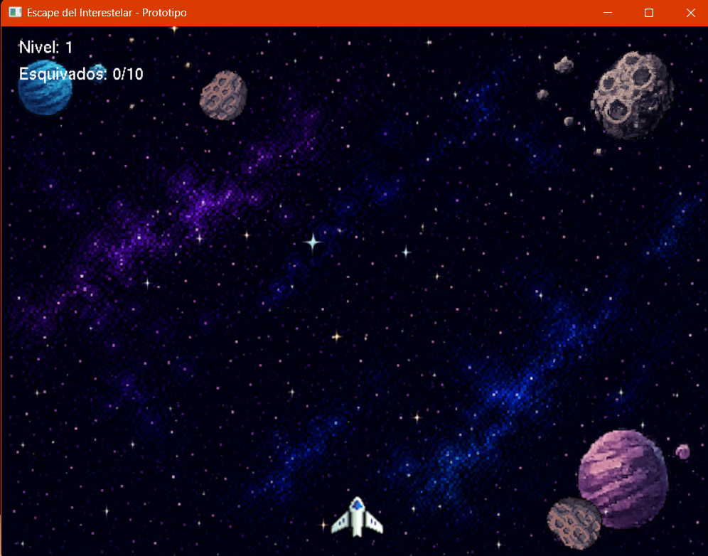
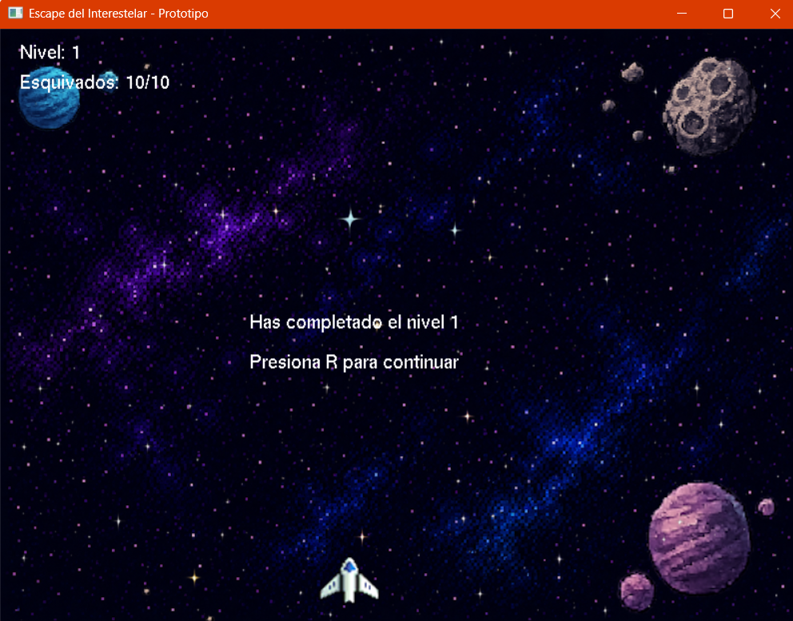
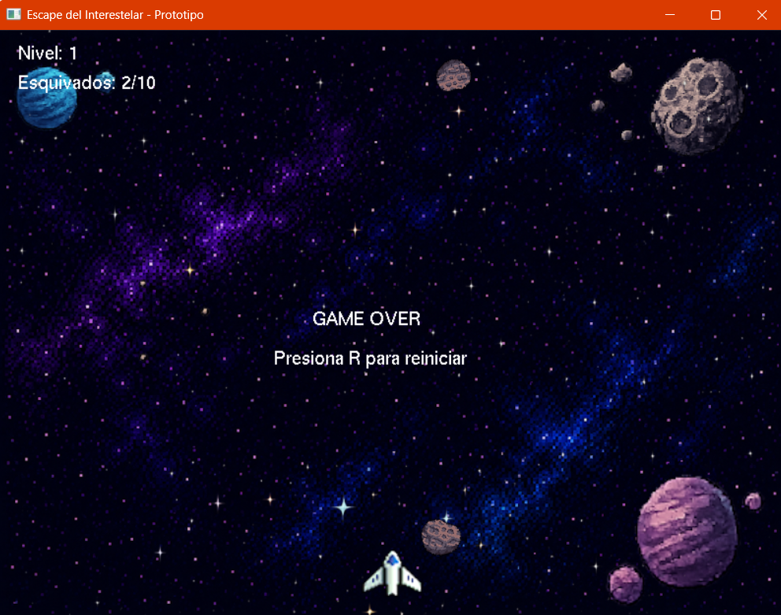

# 🚀 Escape del Interestelar

Videojuego 2D desarrollado en C++ usando OpenGL y FreeGLUT.

El jugador controla una nave espacial que debe esquivar asteroides mientras atraviesa el espacio.  
El objetivo del nivel 1 es sobrevivir y esquivar 10 asteroides para completar la misión.

---

# 🎮 Características

- Movimiento lateral de la nave
- Fondo espacial animado
- Asteroides con rotación
- Colisiones en tiempo real
- Sistema de niveles
- Contador de asteroides esquivados
- Pantalla de victoria
- Pantalla de Game Over
- Reinicio del juego

---

# 🕹️ Controles

| Tecla | Acción |
|---|---|
| A | Mover izquierda |
| D | Mover derecha |
| R | Reiniciar juego |

---

# 🧠 Mecánica del juego

- Los asteroides caen desde la parte superior de la pantalla.
- Cuando un asteroide alcanza aproximadamente 3/4 de la pantalla, aparece el siguiente.
- El jugador debe esquivar todos los asteroides sin colisionar.
- Al esquivar 10 asteroides:
  
```text
Has completado el nivel 1
```

---

# 🛠️ Tecnologías utilizadas

- C++
- OpenGL
- FreeGLUT
- stb_image
- CodeBlocks

---

# 📂 Estructura del proyecto

```text
Escape_del_Interestelar/
│
├── assets/
│   ├── nave.png
│   ├── asteroide_01.png
│   ├── espacio_lejano.png
│   └── estrellas_movil.png
│
├── libs/
│   └── stb/
│       └── stb_image.h
│
├── src/
│   └── main.cpp
│
├── bin/
│   └── EscapeInterestelar.exe
│
└── README.md
```

---

# ⚙️ Compilación

## Requisitos

- MinGW GCC
- OpenGL
- FreeGLUT
- CodeBlocks (opcional)

---

## Ejecutar

Abrir el proyecto:

```text
EscapeInterestelar.cbp
```

y compilar desde CodeBlocks.

---

# 🖼️ Capturas

## Gameplay



## Victoria



## Game Over



---

# 🔮 Mejoras futuras

- Más niveles
- Sistema de puntaje
- Power-ups
- Sonidos
- Música de fondo
- Disparos
- Enemigos especiales
- Menú principal
- Sistema de vidas

---

# 👨‍💻 Autor

Jhanilde Pozo Hernandez

---

# 📜 Licencia

Proyecto académico con fines educativos.
